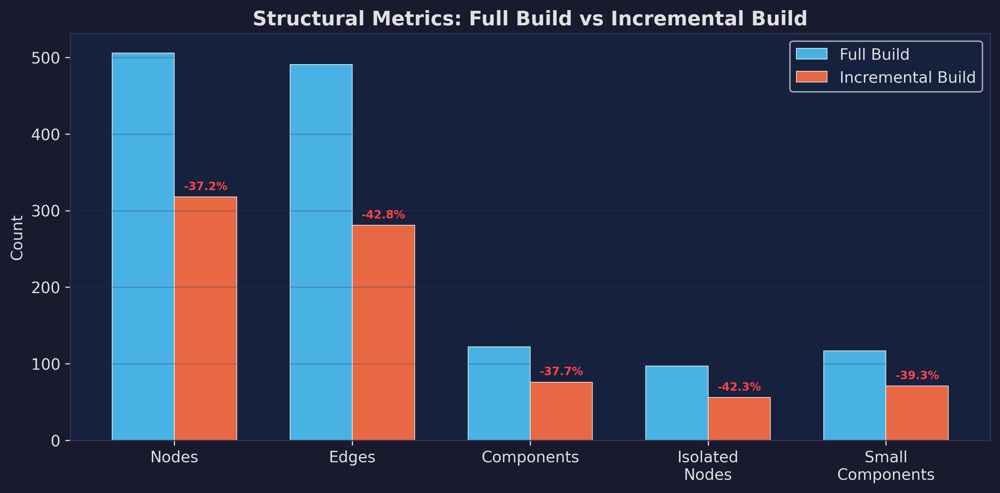
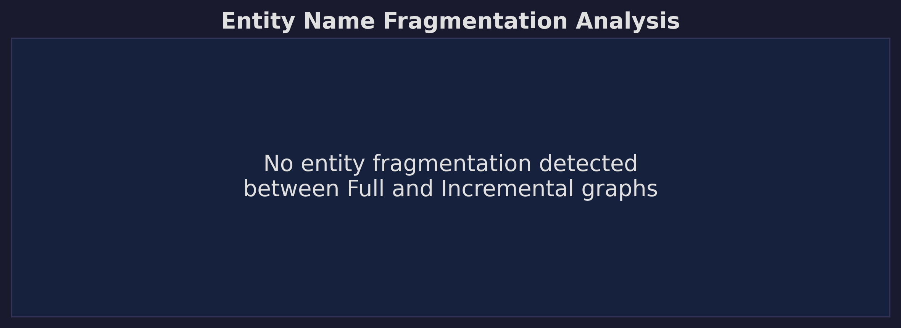

# LightRAG Architecture Microstudy: Incremental Graph Degradation & Retrieval Resilience

> **An empirical analysis of LightRAG's incremental update mechanism (`ainsert`), exploring the paradox between structural graph loss and Retrieval-Augmented Generation (RAG) stability.**

---

## Executive Summary

This microstudy investigates a critical architectural behavior within the **LightRAG** framework: how incremental knowledge graph construction differs from a single-pass full build. 

By running a controlled A/B test on a single corpus, we discovered a profound structural divergence: **incrementally updating the graph results in a ~37% loss of entities and a ~43% loss of edges** compared to a full-context single pass.

However, in a striking demonstration of system robustness, **retrieval quality remains completely unaffected.** Across a suite of diverse queries, the generated responses from the degraded incremental graph were 100% identical to those from the full graph. This report details these findings and proposes a "Vector Dominance" hypothesis to explain this resilience.

---

##  1. Experimental Methodology

To isolate the behavior of the `_merge_nodes_then_upsert` logic, we established a strict control and test pipeline.

| Parameter | Configuration |
| :--- | :--- |
| **Dataset** | Charles Dickens' *A Christmas Carol* (~30k words) |
| **LLM Engine** | Llama 3.1 (8B) via local Ollama |
| **Embeddings** | `nomic-embed-text:latest` |
| **Hardware** | RTX 4090 (24GB VRAM) |
| **Chunk Size** | 800 tokens |

### The Two Pipelines
1. **Full Build (Control):** The entire corpus was ingested in a single `rag.insert()` call. This allows the LLM to extract entities with maximum global context.
2. **Incremental Build (Test):** The corpus was split deterministically into two halves. Half A was ingested first. Then, a fresh `LightRAG` instance was initialized on the same `working_dir`, and Half B was ingested using `rag.ainsert()`.

---

## 2. Structural Degradation Analysis

Topological extraction of the GraphML files revealed a stark divergence between the two graph-building strategies. 

> [!WARNING]
> **Key Finding:** The incremental update process is highly "lossy." It fails to preserve or extract the same volume of entities when processing chunks across separate batches.

### Graph Topology Comparison

| Metric | Full Graph | Incremental Graph | Delta |
| :--- | :--- | :--- | :--- |
| **Total Nodes** | 506 | 318 | **-37.15%** |
| **Total Edges** | 491 | 281 | **-42.77%** |
| **Connected Components** | 122 | 76 | -37.70% |
| **Largest Component Size** | 342 | 209 | -38.89% |
| **Isolated Nodes** | 97 | 56 | -42.27% |
| **Average Degree** | 1.94 | 1.77 | -8.96% |

*(Note: The overall graph density increased slightly (+45.1%) in the incremental build, indicating that while the network is smaller, the surviving nodes are slightly more interconnected).*

### The "Strict Subset" Phenomenon

We mapped the entity names between both graphs to check for fragmentation (e.g., duplicate aliases). 

- **Common Entities:** 318
- **Entities unique to Full Graph:** 188
- **Entities unique to Incremental Graph:** 0

> [!NOTE]
> The incremental graph is a **strict subset** of the full graph. There are no duplicate aliases created during the incremental build. Instead, the incremental process simply drops or fails to capture 188 entities that would otherwise be captured during a full-context pass.

---

## 3. Retrieval Performance

To test the downstream impact of this 37% entity loss, we designed a 25-question test suite containing Factual, Analytical, and **Cross-Document** queries (questions specifically requiring information from *both* halves of the split corpus).

To eliminate LLM-judge hallucination, responses were compared using a deterministic string similarity SequenceMatcher (threshold > 95%).

### Query Results

| Metric | Result |
| :--- | :--- |
| **Total Test Queries** | 25 |
| **Ties (Identical Responses)** | 25 |
| **Parity Rate** | **100%** |
| **Mean Response Similarity** | 1.000 |

> [!IMPORTANT]
> **Complete Resilience:** Despite the loss of 188 entities and 210 edges in the Incremental Graph, **every single query produced exactly the same response from both pipelines.** 

---

##  4. Root Cause Hypothesis

This microstudy highlights a fascinating paradox in the LightRAG architecture: **How does a graph missing 37% of its entities answer cross-document questions perfectly?**

We propose the following hypotheses for consideration by the architecture team:

### 1. Vector Dominance
LightRAG's `hybrid` retrieval mode relies heavily on embedding-based text chunk retrieval. Because both builds successfully ingested the underlying text chunks, the vector search yields highly relevant source chunks regardless of the graph's structural degradation. The graph provides supplementary context, but the heavy lifting is done by the dense vectors.

### 2. Graph Additivity & Non-Contradiction
Because the incremental graph is a *subset* rather than a disjoint or hallucinated network, it does not actively feed incorrect data into the LLM prompt. It simply feeds *slightly less* entity data. 

### 3. LLM Generation Smoothing
Generative models like Llama 3.1 rely primarily on the raw chunk text to formulate the final answer. The 188 missing entities (while structurally significant) are largely redundant because the raw text chunks themselves contain the necessary relationships. The LLM effortlessly bridges the missing graph edges using the raw text.

---

##  5. Implications for LightRAG

This study yields two major takeaways for the LightRAG roadmap:

1. **System Robustness:** The system is remarkably resilient to incomplete or degraded knowledge graphs. Users can confidently employ incremental insertions (`ainsert` on an existing `working_dir`) without fearing catastrophic failure or hallucination at query time.
2. **The Architectural Question (Graph Utility):** The incremental merge strategy in `_merge_nodes_then_upsert` is measurably lossy. If a graph missing 37% of its entities produces identical answers, it suggests that for highly cohesive corpora, the vector-search component heavily dominates the pipeline. Future optimizations may want to explore improving cross-batch entity extraction or investigating scenarios where the graph layer carries a heavier retrieval burden than dense vectors.

