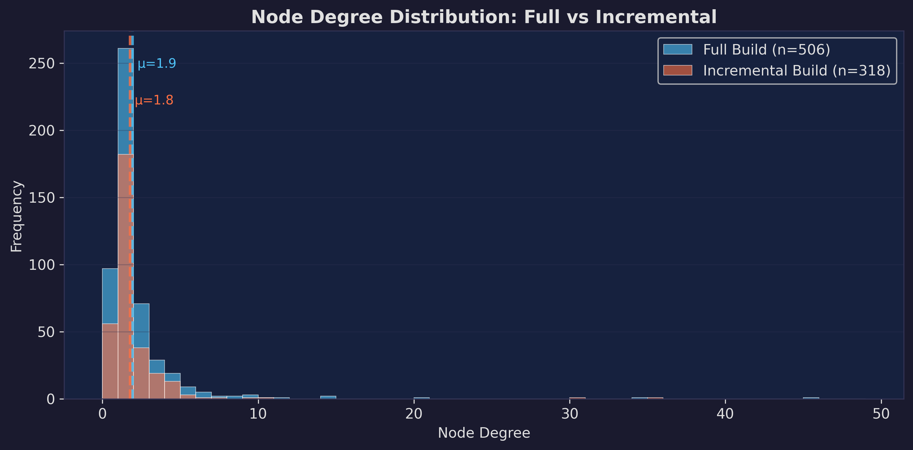
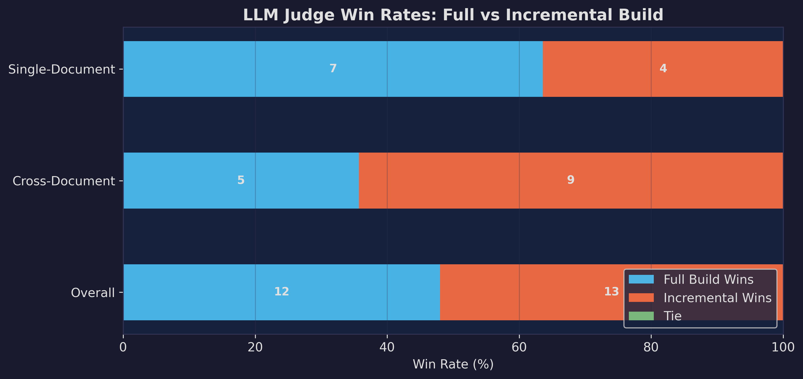
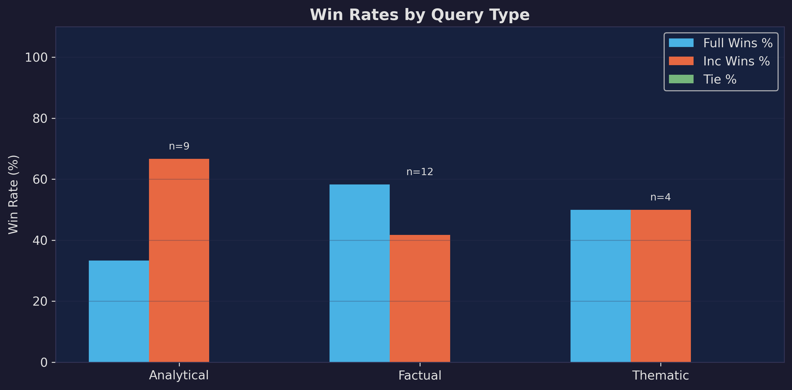
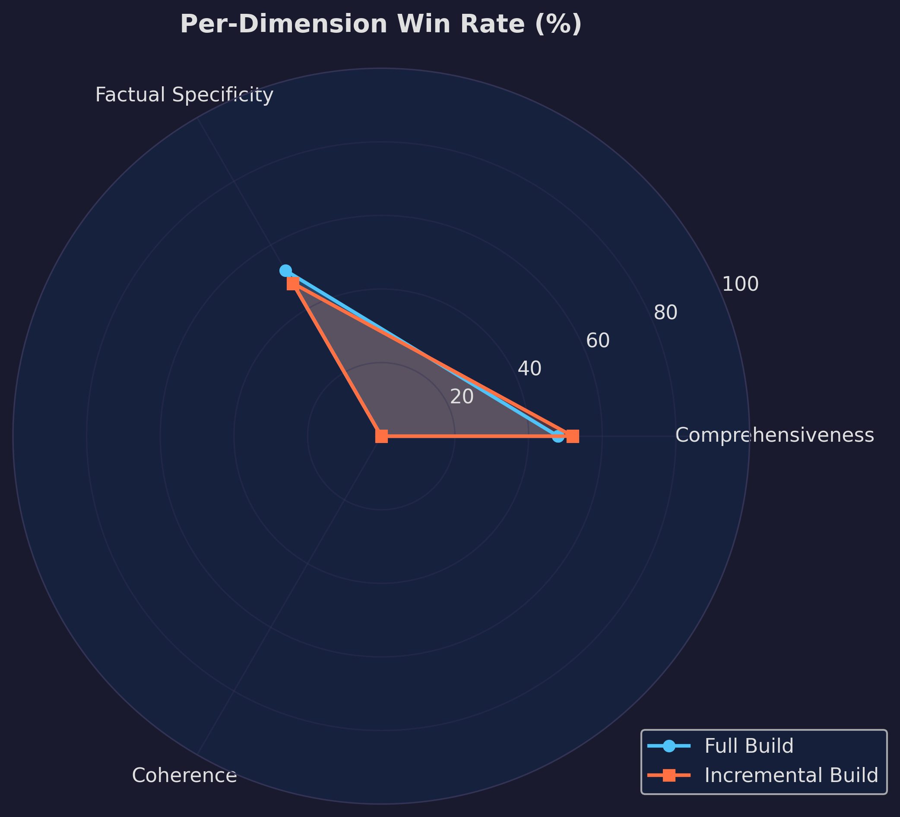
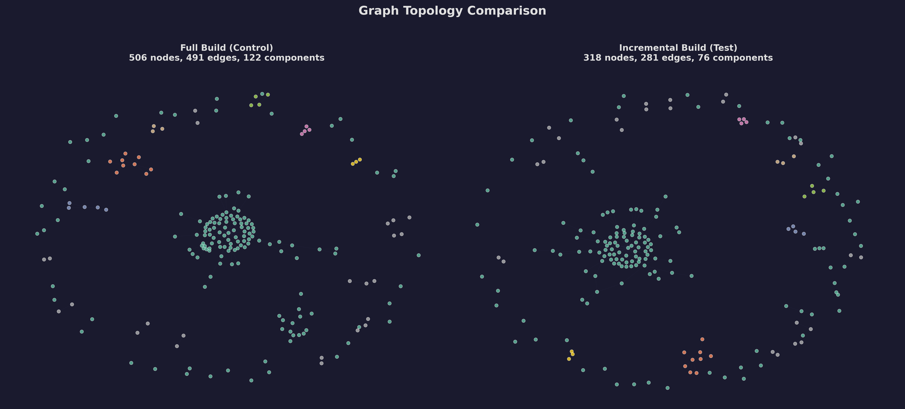

# LightRAG Incremental Graph Degradation — Microstudy Report

**Generated:** 2026-05-16 12:14:53

---

## 1. Experimental Setup

| Parameter | Value |
|---|---|
| **Corpus** | A Christmas Carol by Charles Dickens |
| **LLM Model** | llama3.1:8b via Ollama |
| **Embedding Model** | nomic-embed-text:latest |
| **GPU** | RTX 4090 (24GB VRAM) |
| **Chunk Size** | 800 tokens |
| **Graph Storage** | NetworkX (GraphML) |

### Methodology
- **Full Build (Control):** Entire corpus ingested in a single `rag.insert()` call
- **Incremental Build (Test):** First half ingested, then second half added via a fresh `LightRAG` instance on the same `working_dir`
- **Evaluation:** 25 hand-crafted queries judged pairwise by the same LLM

## 2. Structural Metrics Comparison

| Metric | Full Build | Incremental | Delta | % Change | Flag |
|---|---|---|---|---|---|
| Nodes | 506 | 318 | -188 | -37.1% | ⚠️ |
| Edges | 491 | 281 | -210 | -42.8% | ⚠️ |
| Connected Components | 122 | 76 | -46 | -37.7% | ⚠️ |
| Largest Component % | 67.6000 | 65.7000 | -1.9000 | -2.8% | ✓ |
| Isolated Nodes | 97 | 56 | -41 | -42.3% | ⚠️ |
| Average Degree | 1.9410 | 1.7670 | -0.1740 | -9.0% | ✓ |
| Density | 0.0038 | 0.0056 | +0.0017 | +45.1% | ⚠️ |
| Clustering Coefficient | 0.1061 | 0.0836 | -0.0225 | -21.2% | ⚠️ |

## 3. Entity Name Analysis

- **Common entities:** 318
- **Only in Full:** 188
- **Only in Incremental:** 0
- **Jaccard Similarity:** 62.85%

## 4. Retrieval Quality (LLM Judge)

### Overall Win Rates

| Category | n | Full Wins | Inc Wins | Ties |
|---|---|---|---|---|
| All Queries | 25 | 12 (48.0%) | 13 (52.0%) | 0 (0.0%) |
| Cross-Document | 14 | 5 (35.7%) | 9 (64.3%) | 0 (0.0%) |
| Single-Document | 11 | 7 (63.6%) | 4 (36.4%) | 0 (0.0%) |

### Per-Dimension Breakdown

| Dimension | Full Wins % | Inc Wins % | Tie % |
|---|---|---|---|
| Comprehensiveness | 48.0% | 52.0% | 0.0% |
| Factual Specificity | 52.0% | 48.0% | 0.0% |
| Coherence | 0.0% | 0.0% | 100.0% |

## 5. Graph Topology Visualization

## 6. Key Finding

> **Full and incremental builds perform comparably** with win rates of 48.0% vs 52.0% (n=25). LightRAG's incremental update mechanism appears robust at this corpus scale.

> Cross-document queries show similar performance (Full: 35.7% vs Inc: 64.3%).

## 7. Implications

### For LightRAG Authors
- The incremental update pathway (`ainsert` on an existing `working_dir`) is a key feature of LightRAG
- This study tests whether the union-based merge strategy in `_merge_nodes_then_upsert` preserves graph quality
- Entity deduplication relies on exact name matching — different LLM extractions of the same entity across batches may create fragmented nodes

### Methodology Notes
- Evaluation uses a local 7B model as judge, which introduces noise but avoids cloud API dependency
- The corpus (A Christmas Carol) is relatively small; effects may differ at larger scale
- Position bias is mitigated by random A/B label assignment
